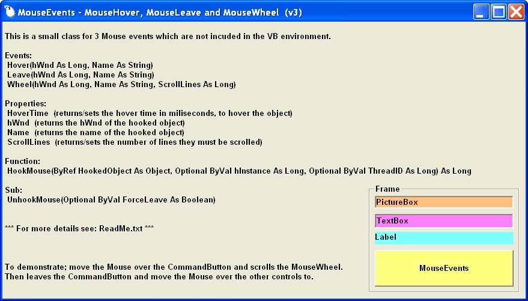



## MouseEvents trapping

### Description

This class will trapped the mouse events. also including the MouseLeave event.
 
### More Info
 

             |
---                |---
**Submitted On**   |2008-10-14 16:52:00
**By**             |[Ben Vonk](https://github.com/Planet-Source-Code/PSCIndex/blob/master/ByAuthor/ben-vonk.md)
**Level**          |Intermediate
**User Rating**    |5.0 (15 globes from 3 users)
**Compatibility**  |VB 6\.0
**Category**       |[VB function enhancement](https://github.com/Planet-Source-Code/PSCIndex/blob/master/ByCategory/vb-function-enhancement__1-25.md)
**World**          |[Visual Basic](https://github.com/Planet-Source-Code/PSCIndex/blob/master/ByWorld/visual-basic.md)
**Archive File**   |[MouseEvent21307910152008\.zip](https://github.com/Planet-Source-Code/ben-vonk-mouseevents-trapping__1-71027/archive/master.zip)

